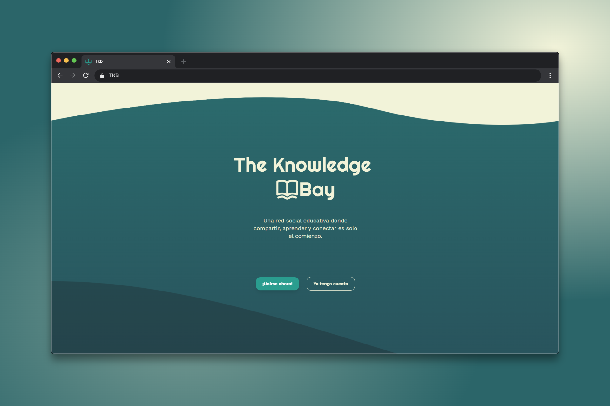
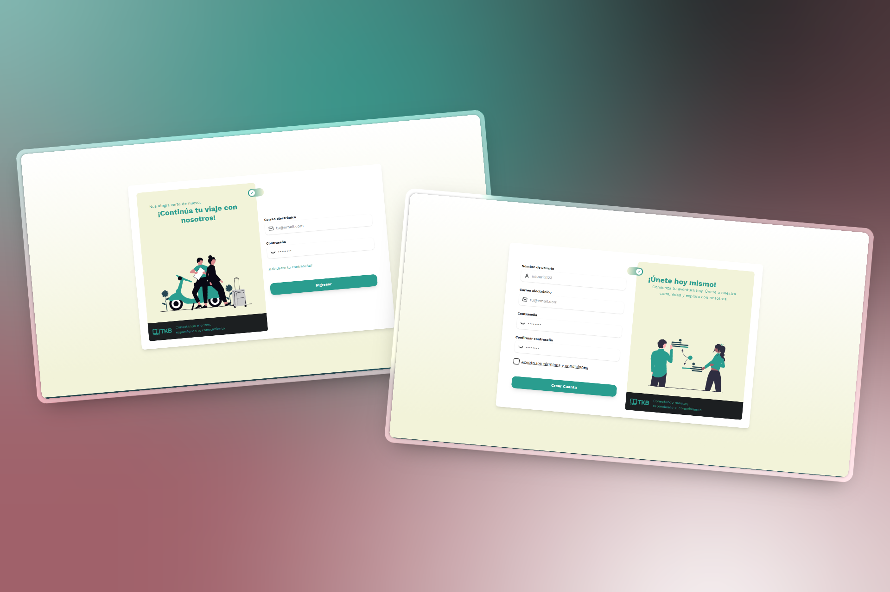
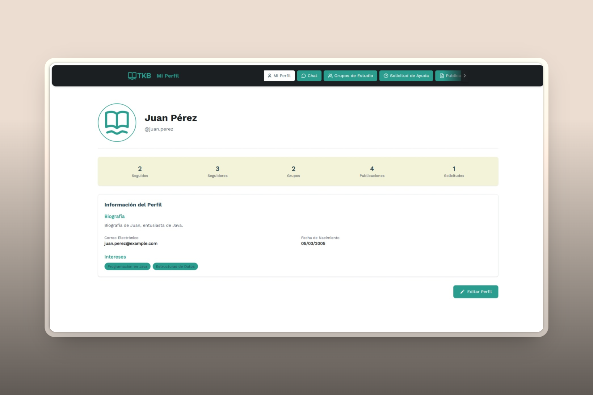
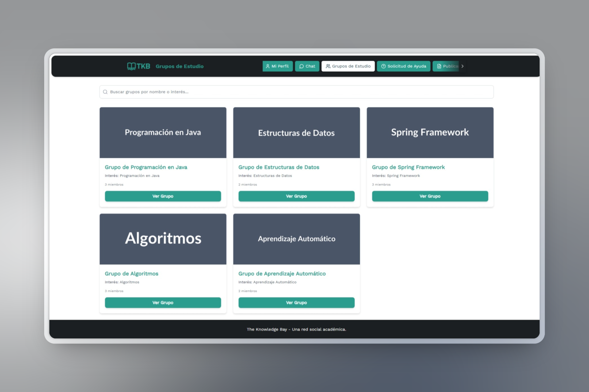
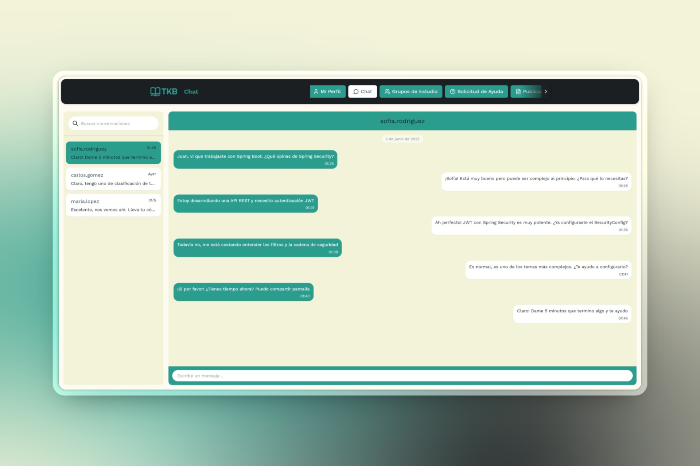
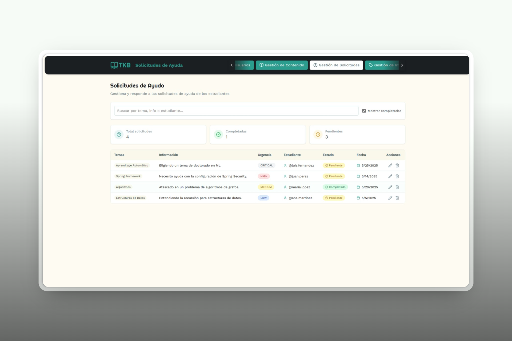
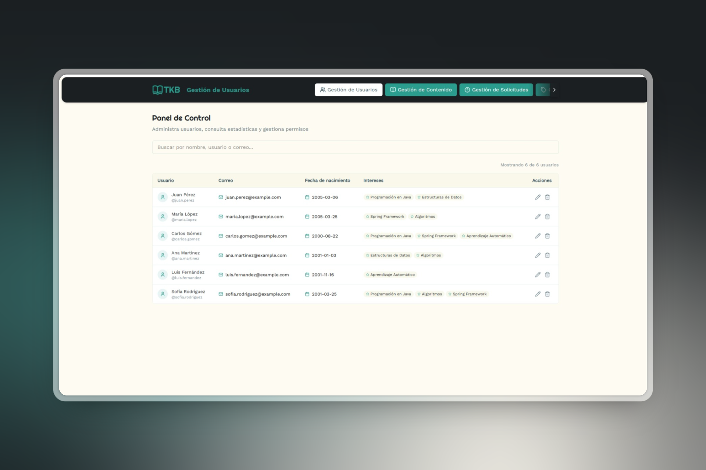
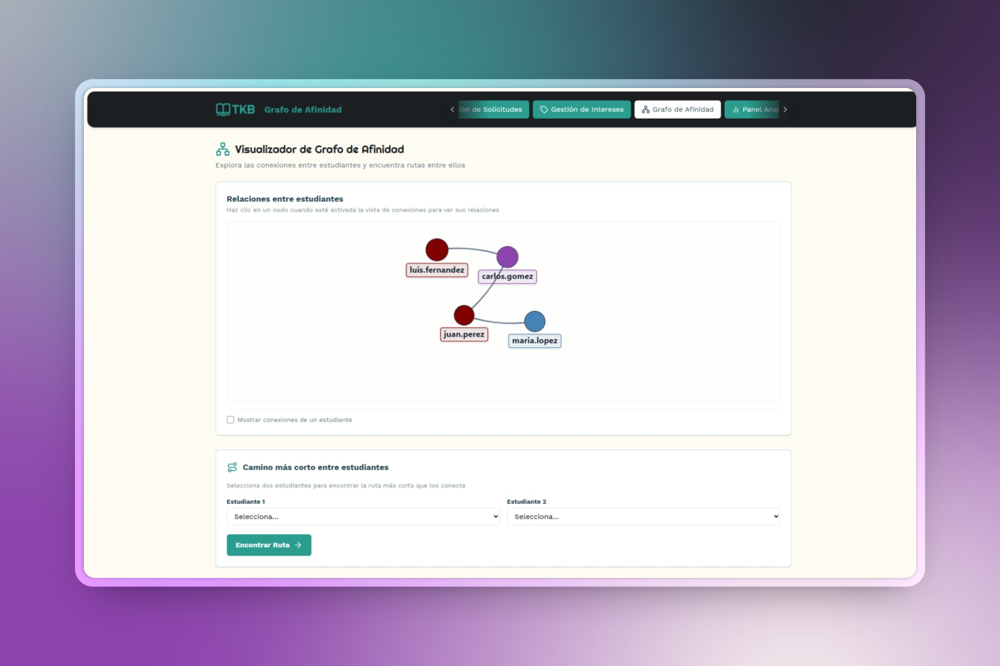

<div align="center">
  
  <br/>
</div>

# 📖 Introduction

Welcome to The Knowledge Bay! 🌟 This project is a centralized platform designed to empower users by providing easy access to a vast repository of information and resources. In a world overflowing with data, finding reliable and relevant knowledge can be challenging. The Knowledge Bay aims to solve this by curating and organizing information, making it readily available and digestible. Our main goal is to foster a community of learners and knowledge-sharers, enabling users to explore diverse topics, contribute their expertise, and collaborate effectively.

# ✨ Features

- 🔐 User Authentication: Secure sign-up, sign-in, and password reset functionalities.
- 📚 Content Management: Easily create, read, update, and delete articles, documents, and other learning resources.
- 🔍 Advanced Search: Quickly find relevant information with a powerful and intuitive search engine.
- 💬 Discussion Forums: Engage in discussions, ask questions, and share insights with the community.
- 👤 User Profiles: Create and manage personal profiles, track learning progress, and showcase contributions.
- 🛠️ Admin Panel: Comprehensive dashboard for site administrators to manage users, content, and site settings.
- 📊 Analytics & Reporting: Gain insights into content popularity, user engagement, and platform usage.
- 📱 Responsive Design: Seamless experience across desktops, tablets, and mobile devices.
- ⭐ Personalized Recommendations: Discover content tailored to your interests and learning history.
- 🏷️ Tagging & Categorization: Organize and browse content effectively with a flexible tagging system.

# 🛠️ Tech Stack

## 💻 Front-End

- **Framework/Library:** React
- **Build Tool:** Vite
- **Styling:** Tailwind CSS
- **UI Components:** @ark-ui/react, lucide-react, react-icons
- **Routing:** React Router DOM
- **HTTP Client:** Axios
- **Charting/Graphs:** d3-force, react-force-graph-2d, recharts
- **Linting/Formatting:** ESLint, Prettier
- **Other:** next-themes, prop-types, react-markdown, react-player

## ⚙️ Back-End

- **Framework:** Spring Boot
- **Language:** Java (version 21)
- **Security:** Spring Security (with BCrypt for password hashing)
- **Database:** SQLite, Spring Boot Starter JDBC
- **Build Tool:** Maven
- **Other:** Lombok

# 📂 Project Structure

The project is organized into the following main directories:

- 📁 `client/`: Contains the front-end React application.
  - 📁 `public/`: Static assets like `index.html`, favicons, and other files that are not processed by the build system.
  - 📁 `src/`: Contains all the client-side source code.
    - `assets/`: Static assets such as images, fonts, and global styles.
    - `components/`: Reusable UI components (e.g., buttons, forms, navigation bars).
    - `context/`: React Context API providers for global state management.
    - `data/`: Sample or static data used by the application (e.g., JSON files).
    - `hooks/`: Custom React hooks to encapsulate reusable logic.
    - `pages/`: Page-level components that represent different views/routes of the application.
    - `services/`: Modules for interacting with the back-end API or other external services.
    - `styles/`: Global stylesheets and component-specific style modules.
- 📁 `docs/`: Contains project documentation, diagrams, and mockups.
  - `diagrams/`: Includes system architecture diagrams, database schemas, and other visual documentation.
  - `mockups/`: Contains UI mockups and prototypes for different application views.
- 📁 `server/`: Contains the back-end Spring Boot application.
  - 📁 `src/main/java/`: Contains the Java source code for the server-side application.
  - 📁 `src/main/resources/`: Contains non-Java resources like configuration files (`application.properties`), static assets served by the backend, and templates.
  - 📁 `src/test/java/`: Contains unit and integration tests for the server-side application.
- `.gitignore`: Specifies intentionally untracked files that Git should ignore (e.g., `node_modules/`, `target/`, IDE-specific files).
- `LICENSE.md`: Contains the full text of the project's license.
- `README.md`: This file, providing an overview of the project, setup instructions, and other relevant information.

# ✅ Prerequisites

Before you begin, ensure you have the following software and tools installed on your system:

- 🟢 **Node.js & npm:** JavaScript runtime and package manager, used for the front-end application. We recommend using the latest LTS version.
  - [Download Node.js (which includes npm)](https://nodejs.org/)
- ☕ **Java Development Kit (JDK):** Required for the back-end Spring Boot application. Version 21 is used in this project.
  - [Download OpenJDK 21](https://openjdk.java.net/projects/jdk/21/) or Oracle JDK 21.
- Ⓜ️ **Apache Maven:** Build automation tool used for the Java project. A recent version (e.g., 3.6.x or higher) is recommended.
  - [Download Apache Maven](https://maven.apache.org/download.cgi)
  - [Installation Guide](https://maven.apache.org/install.html)
-  VCS **Git:** Distributed version control system for tracking changes and collaborating.
  - [Download Git](https://git-scm.com/downloads)
  - [Installation Guide](https://git-scm.com/book/en/v2/Getting-Started-Installing-Git)
# 🚀 Installation and Setup

Follow these steps to get The Knowledge Bay up and running on your local machine.

## 💻 Client (Front-End)

1.  **Navigate to the client directory:**
    ```bash
    cd client
    ```

2.  **Install dependencies:**
    Using npm:
    ```bash
    npm install
    ```
    Or using yarn:
    ```bash
    yarn install
    ```

3.  **Start the development server:**
    Using npm:
    ```bash
    npm run dev
    ```
    Or using yarn:
    ```bash
    yarn dev
    ```

## ⚙️ Server (Back-End)

1.  **Navigate to the server directory:**
    (Assuming you are in the project root)
    ```bash
    cd server
    ```

2.  **Build the project and install dependencies:**
    This command compiles the Java code, runs tests, and packages the application.
    ```bash
    mvn clean install
    ```

3.  **Run the Spring Boot application:**
    ```bash
    mvn spring-boot:run
    ```

4.  The server should now be running on `http://localhost:8080` (Spring Boot's default port). You can access the API endpoints once the server has started successfully.

# 🎮 Usage

Once both the client and server are running, you can start using The Knowledge Bay:

1.  **Access the Application:**
    Open your web browser and navigate to `http://localhost:3000` (or the port your client is running on).

2.  **User Registration and Login:**
    - **Sign Up:** If you are a new user, look for a "Sign Up" or "Register" option. You will typically need to provide a username, email, and password.
    - **Log In:** If you already have an account, use the "Log In" or "Sign In" option with your credentials.

3.  **Navigating the Platform:**
    - After logging in, you'll likely land on a dashboard or home page.
    - Use the navigation bar or menu (often at the top or side of the page) to explore different sections such as:
        - Your user profile.
        - Areas for browsing or creating content (articles, resources, etc.).
        - Discussion forums or community pages.
        - Search functionality.

4.  **Interacting with Content:**
    - **Viewing:** Browse through available articles, documents, or other resources.
    - **Creating:** Depending on your permissions, you might be able to create new content, upload files, or write articles.
    - **Searching:** Utilize the search bar to find specific topics or keywords.
    - **Commenting/Discussing:** Engage with content by leaving comments or participating in discussion threads.

Enjoy exploring and contributing to The Knowledge Bay!

# 🌐 API Endpoints

The following is a selection of key API endpoints available in The Knowledge Bay. For a complete list and more detailed information, please examine the controller classes within the `server/src/main/java/co/edu/uniquindio/theknowledgebay/api/controller/` directory. The base path for all API endpoints is `/api`.

### 🔑 Authentication Endpoints (`/api/auth`)

-   `POST /register`: Registers a new user.
-   `POST /login`: Logs in an existing user and returns a JWT token upon successful authentication.
-   `POST /logout`: Logs out the currently authenticated user.

### 📝 Content Endpoints (`/api/content`)

-   `POST /`: Creates new content (e.g., article, resource). Supports multipart requests for file uploads.
-   `GET /my-content`: Retrieves all content created by the currently authenticated user.
-   `GET /`: Retrieves all content available in the system.
-   `GET /{id}`: Retrieves a specific piece of content by its unique ID.
-   `PUT /{id}`: Updates an existing piece of content by its ID.
-   `DELETE /{id}`: Deletes a specific piece of content by its ID.
-   `POST /{id}/like`: Likes a specific piece of content.
-   `DELETE /{id}/like`: Removes a like from a specific piece of content.

### 👥 User Endpoints (`/api/users`)

-   `GET /`: Retrieves a list of all users. Supports optional query parameters for filtering, such as:
    -   `search` (string): Filters users by username or other profile fields.
    -   `interest` (string): Filters users by declared interests.
-   `GET /{userId}`: Retrieves profile information for a specific user by their `userId`. 
-   `PUT /profile`: Updates the profile information of the currently authenticated user.
-   `POST /{userId}/follow`: Allows the authenticated user to follow the user specified by `userId`. 
-   `DELETE /{userId}/follow`: Allows the authenticated user to unfollow the user specified by `userId`. 
-   `GET /search?query={searchTerm}`: Searches for users based on a `searchTerm`. This might be an alias or a more specific search than the general `GET /` with a search parameter.

# 🧪 Testing

1.  **Running Tests:**
    To execute the unit and integration tests for the server-side Spring Boot application, navigate to the `server` directory and use the following Maven command:
    ```bash
    cd server
    mvn test
    ```
    This command will compile the test classes, run all tests annotated with `@Test` (or similar, depending on the testing framework like JUnit), and report the results.

# 🤝 Contributing

Contributions are what make the open-source community such an amazing place to learn, inspire, and create. Any contributions you make to The Knowledge Bay are **greatly appreciated**!

If you have a suggestion that would make this better, please fork the repo and create a pull request. You can also simply open an issue with the tag "enhancement".
Don't forget to give the project a star! Thanks again!

## Standard Steps to Contribute

1.  🍴 **Fork the Project**
    - Click the "Fork" button at the top right of the main repository page.
    - Clone your fork to your local machine:
      ```bash
      git clone https://github.com/YOUR_USERNAME/THE_KNOWLEDGE_BAY_FORK.git 
      ```

2.  🌿 **Create your Feature Branch**
    - Navigate to your local repository:
      ```bash
      cd THE_KNOWLEDGE_BAY_FORK 
      # Or your project's directory name, which is likely THE_KNOWLEDGE_BAY_FORK after cloning
      ```
    - Create a new branch for your feature or bug fix. It's good practice to use a descriptive branch name, like `feature/AmazingFeature` or `fix/LoginBug`.
      ```bash
      git checkout -b feature/AmazingFeature
      ```

3.  💾 **Commit your Changes**
    - Make your changes and stage them:
      ```bash
      git add .
      ```
    - Commit your changes with a clear and descriptive commit message. We encourage using [Conventional Commits](https://www.conventionalcommits.org/en/v1.0.0/) format (e.g., `feat: Add user profile page`, `fix: Correct spelling errors in documentation`).
      ```bash
      git commit -m 'feat: Add some AmazingFeature'
      ```

4.  🚀 **Push to the Branch**
    - Push your changes to your forked repository on GitHub:
      ```bash
      git push origin feature/AmazingFeature
      ```

5.  📬 **Open a Pull Request**
    - Go to your fork on GitHub and click the "New pull request" or "Compare & pull request" button.
    - Ensure the base repository's `main` or `develop` branch is selected as the target, and your feature branch is selected as the source.
    - Fill in the pull request template with details about your changes.

## Coding Standards

- Please ensure your code adheres to the existing style and formatting conventions found in the project.
- Run any available linters and formatters (e.g., `npm run lint` for the client) before committing.
- Any new features should be accompanied by tests where applicable, and existing tests should pass with your changes.

## Discussing Changes

For significant changes, such as adding a major feature or refactoring core components, it's a good idea to open an issue first to discuss your ideas with the maintainers. This helps ensure your contributions align with the project's goals and roadmap.

We look forward to your contributions!

# 📄 License

This project is distributed under the terms of the license specified in `LICENSE.md`.
Please see the `LICENSE.md` file in the root of the project for the full license text and details.

# 🙏 Acknowledgements

A big thank you to the open-source community and the developers of the tools and libraries that make The Knowledge Bay possible. Your work is greatly appreciated!

We also thank all users and contributors who help make this platform a thriving space for learning and collaboration.

# 📧 Contact

Project Maintainers: 
- **Diego Flores:** diegoa.floresq@uqvirtual.edu.co
- **Jorge Acosta:** jorgei.acostaa@uqvirtual.edu.co
- **July Cartagena:** julyt.cartagenam@uqvirtual.edu.co

Project Link: [https://github.com/diegnghtmr/the-knowledge-bay](https://github.com/diegnghtmr/the-knowledge-bay)

For questions, feedback, feature requests, or support, please:
1.  Open an issue on the GitHub repository: [https://github.com/diegnghtmr/the-knowledge-bay/issues](https://github.com/diegnghtmr/the-knowledge-bay/issues)
2.  Alternatively, reach out to the maintainers via the email provided above.

We welcome your input and contributions to make The Knowledge Bay even better!

**Make this section compelling!** Clearly articulate the benefits and standout features of The Knowledge Bay.

# 🗺️ Roadmap

Here are some of the exciting features and improvements planned for future versions of The Knowledge Bay:

-   🧠 Implement advanced AI-powered content recommendations and personalized learning paths.
-   📝 Introduce real-time collaborative features, such as shared document editing or virtual whiteboards.
-   🏆 Expand gamification elements (badges, points, leaderboards) to further boost user engagement and motivation.
-   📱 Develop dedicated mobile applications for iOS and Android to enhance accessibility on the go.
-   🔗 Integrate with external services and APIs (e.g., Zotero, Mendeley for citation management; Coursera, edX for course linking).
-   ♿ Enhance accessibility features to ensure compliance with WCAG (Web Content Accessibility Guidelines) standards.
-   🌐 Internationalization and localization support for multiple languages.
-   🛠️ More robust analytics and reporting tools for content creators and administrators.

This roadmap is subject to change based on community feedback and project priorities.

See the [open issues](https://github.com/diegnghtmr/the-knowledge-bay/issues) for a more detailed list of proposed features, ongoing discussions, and known issues.
# 🧑‍💻 Contributors

A big thanks to all the wonderful people who have contributed their time and expertise to The Knowledge Bay! ✨ Every contribution, big or small, is greatly appreciated.

You can recognize our contributors here:

<p align="center">
  <a href="https://github.com/diegnghtmr" target="_blank" rel="noopener">
    
  </a>
  &nbsp;&nbsp;
  <a href="https://github.com/Jorge-ivan-aa" target="_blank" rel="noopener">
    
  </a>
  &nbsp;&nbsp;
  <a href="https://github.com/tatianacartagena" target="_blank" rel="noopener">
    
  </a>
</p>

# 📸 Screenshots

Here's a sneak peek of The Knowledge Bay in action! This section showcases the look and feel of the application.

---


_Caption: The landing page that welcomes users to The Knowledge Bay platform._

---


_Caption: The authentication interface for user login and registration._

---


_Caption: A user's profile page, showcasing their information, followers/following, and contributions._

---


_Caption: The study groups interface where users can join and participate in collaborative learning._

---


_Caption: The chat system for communication between users._

---


_Caption: The help request system where users can ask for assistance and offer help to others._

---


_Caption: The users directory for discovering and connecting with other members of the community._

---


_Caption: The interactive affinity graph showing relationships and connections between users._

---


_Caption: The administrative analytical dashboard providing insights into platform usage and metrics._

# ⚡ Quick Start

Follow these steps to get The Knowledge Bay up and running quickly on your local machine. This guide assumes you have all prerequisites installed (see the [Prerequisites](#-prerequisites) section).

**1. Clone the Repository:**
```bash
git clone https://github.com/diegnghtmr/the-knowledge-bay
cd the-knowledge-bay
```

**2. Set Up and Run the Back-End (Server):**
Open a new terminal window for the server.
```bash
cd server
mvn clean install
mvn spring-boot:run
# The server will typically be running on http://localhost:8080
```
Wait until the server has started successfully. You should see log messages indicating it's ready.

**3. Set Up and Run the Front-End (Client):**
Open another new terminal window for the client.
```bash
cd ../client 
npm install
npm run dev
# The client will typically be accessible at http://localhost:3000
```
The client development server will usually open the application in your default web browser automatically, or it will display the URL in the terminal.

**4. Open in Browser:**
If it doesn't open automatically, navigate to `http://localhost:3000` (or the port indicated in your client terminal) in your web browser.

You should now have The Knowledge Bay running locally! For more detailed setup instructions, refer to the [Installation and Setup](#-installation-and-setup) section.
# 💡 Tips & Tricks

Here are some tips and tricks to help you get the most out of The Knowledge Bay platform and its development environment:

**For Users:**

-   🌟 **Explore Advanced Search:** Don't just use keywords! Check if there are filters or advanced syntax available to narrow down your search results for content more effectively.
-   👤 **Complete Your Profile:** A well-filled profile can help others with similar interests connect with you and can personalize your experience on the platform.
-   💬 **Engage in Discussions:** The forums or comment sections are great places to ask questions, share your understanding, and learn from others.
-   🔖 **Use Bookmarking/Favorites:** If the platform allows, save interesting content for later so you can easily find it again.
-   🤝 **Collaborate (if applicable):** Look for features that allow collaboration, like shared documents, study groups, or joint projects.

**For Developers:**

-   📄 **Check the `docs/` Folder:** This directory often contains more in-depth diagrams, architectural notes, and design mockups that aren't in the main README.
-   🐛 **Effective Debugging:**
    -   **Client:** Use your browser's developer tools (Network tab, Console, React DevTools extension).
    -   **Server:** Leverage your IDE's debugger for Java. Check server logs in the `server/logs` directory (if configured) or console output.
-   🔄 **Understand the Build Tools:** Familiarize yourself with `vite.config.js` (client) and `pom.xml` (server) to understand build processes, dependencies, and available scripts/goals.
-   🐞 **Reporting Issues:** When you find a bug or have a feature idea, provide clear, detailed information when opening an issue. Include steps to reproduce, expected behavior, and actual behavior.
-   🌲 **Branching Strategy:** Follow the project's branching strategy (e.g., feature branches from `develop` or `main`) when contributing.

*Have a useful tip or trick for The Knowledge Bay? Please consider adding it to this list via a pull request!*
